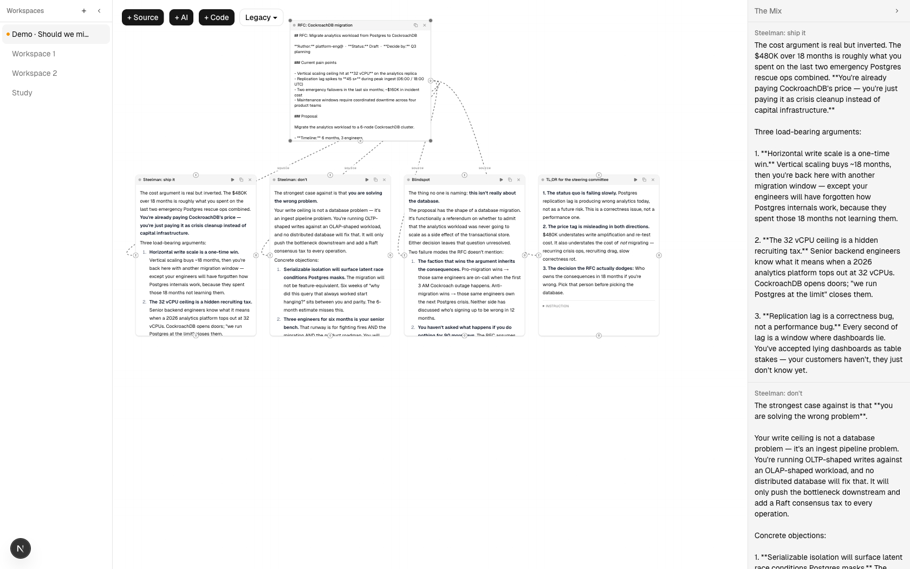
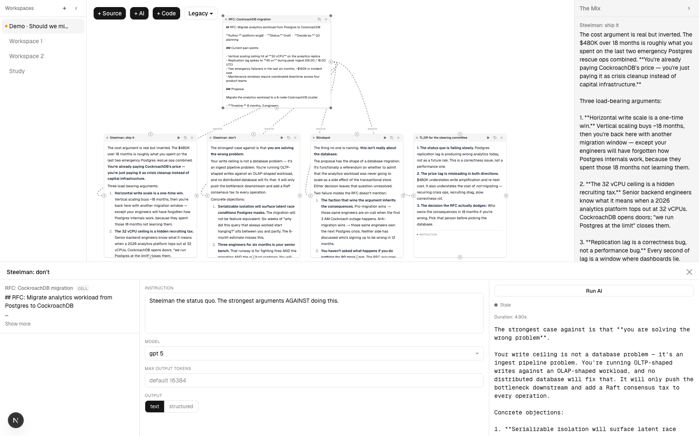

# Patchbay

> Spatial workspace for patching AI signal graphs — wire markdown, PDFs, code, and multi-provider LLM calls into a canvas; the terminal cells are your answer.



*One source RFC fans out to four AI cells (Claude, GPT, Grok, Sonnet) — each with a different instruction. The Mix on the right aggregates every terminal output into one panel. That's your answer.*

## What it is

Patchbay is a Next.js app for composing AI workflows the way a modular synthesist composes sound: drop atomic cells, patch their inputs and outputs, and watch signals cascade through the graph. The terminal cells — the ones with no outgoing connections — surface in a persistent panel called **The Mix**. That's your answer.

Three cell primitives, one connection model:

- **Source** holds text, markdown, or a PDF
- **AI** runs an LLM call (Anthropic, OpenAI, xAI, Google) with optional structured output
- **Code** runs a JavaScript transform in a Web Worker

No predefined pipelines. Identity emerges from how cells are wired, not from type declaration.

## Three things that make it not-just-another-LangFlow

### Signal-field cells with cascade execution

Cells are a discriminated union ([`src/kernel/entities/cell.ts`](src/kernel/entities/cell.ts)) with a single `lastInputHash` field driving freshness. When you trigger a cell, the orchestrator builds a topological schedule downstream ([`src/client/domain/use-cases/execute-cascade.ts`](src/client/domain/use-cases/execute-cascade.ts)), re-resolves inputs, and re-runs cells in dependency order. Stale cells render visually distinct via pure-function staleness propagation ([`src/kernel/transforms/compute-staleness.ts`](src/kernel/transforms/compute-staleness.ts)).

### The Mix and The Scope

**The Mix** is a right-side panel that aggregates every terminal cell's output — your answer, in real time, regardless of how the upstream graph evolves ([`src/client/ui/components/MixPanel.tsx`](src/client/ui/components/MixPanel.tsx)). Double-click any cell and **The Scope** opens at the bottom: a focused three-column editor with Inputs | Editor | Output ([`src/client/ui/hooks/use-scope-state.ts`](src/client/ui/hooks/use-scope-state.ts)). Two panels, two altitudes — the canvas for shape, The Scope for surgery.



### Multi-provider AI behind one route

A single `/api/chat` endpoint ([`src/app/api/chat/route.ts`](src/app/api/chat/route.ts)) dispatches to Anthropic, OpenAI, xAI, or Google via a runtime registry ([`src/server/adapters/providers.ts`](src/server/adapters/providers.ts)). AI cells don't know which provider they're hitting; the user picks per cell. Structured output mode supports both single-object and collection schemas — useful for any "extract a list of N things" pattern.

## Architectural opinions worth reading the code for

- **Port topology, not node type, is the identity system.** A `SourceCellData` connected as input to an AI cell is a different thing than a `SourceCellData` connected to a Code cell — even though it's the same data shape. Wiring is meaning.
- **Clean Architecture wall.** The kernel (`src/kernel/`) imports zero frameworks. No React, no Next.js, no `@xyflow`. It's testable, replaceable, and outlives any UI choice. The boundary is enforced by directory.
- **Strangler-fig migration boundary.** Legacy `WorkspaceNode` types and new signal-field `Cell` types share the same canvas but cannot be wired across the boundary ([`src/kernel/transforms/validate-connection.ts`](src/kernel/transforms/validate-connection.ts), [`src/client/adapters/canvas/flow-node-mapper.ts`](src/client/adapters/canvas/flow-node-mapper.ts)). This is how the codebase migrates without a flag day.

## Use cases the architecture supports today

1. **Multi-model comparison** — one question → three AI cells (Claude, GPT, Grok) → The Mix shows all three side-by-side
2. **PDF summarization chain** — PDF source → AI cell ("summarize") → Code cell (extract bullets) → terminal output
3. **Transform pipeline** — markdown notes → Code cell (parse) → AI cell (tag) → Code cell (dedupe) → tagged list
4. **Iterative refinement** — AI (draft) → Code (cleanup) → AI (improve tone) → Code (format), output visible at each step
5. **Information cascade** — multiple PDF sources → Code cell (merge) → AI cell (synthesize) → single synthesis

## Stack

`Next.js 16 (App Router)` · `TypeScript 5` · `Tailwind CSS 4` · `@xyflow/react` · `Vercel AI SDK` · `Anthropic` · `OpenAI` · `xAI` · `Google Gemini` · `Monaco` · `Clerk` · `Supabase` · `Clean Architecture`

## Run locally

```bash
cp .env.example .env.local
# fill in at least one LLM provider key
npm install
npm run dev
```

Open `http://localhost:3000`. Any single provider key is enough to start — the others are optional.

## How this was built

This repo ships its own spec history. Every meaningful feature lives in [`.specs/features/`](.specs/features/) (active), [`.specs/archive/`](.specs/archive/) (shipped), and [`.specs/rejected/`](.specs/rejected/) (designed and declined). The deliberation protocol — expert roundtables, structural linting, adversarial spec-audit — is the [Feature Architect](https://github.com/pluckey/skills) Claude Code skill, applied to this codebase from the inside.

If you're evaluating this as a portfolio piece for an AI SDLC role: the application of AI to *building* this app is the story. The `.specs/` directory is the artifact.

## Architecture deep-dive

See [`CLAUDE.md`](CLAUDE.md) for the Clean Architecture rules and the strangler-fig boundary, and [`context.md`](context.md) for the current state of the codebase.

## License

[MIT](LICENSE) — Paul Luckey, 2026.
